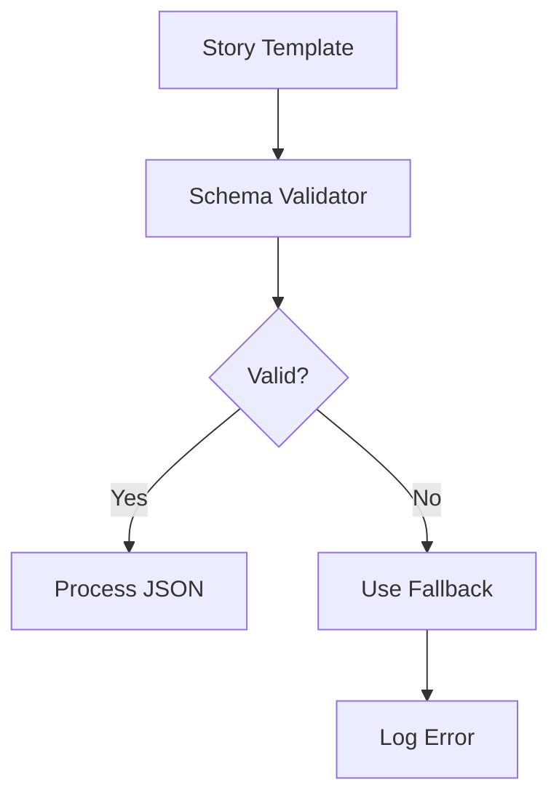

# AI Storytelling System Architecture

## Core Architectural Values

1. **Narrative Integrity**
   - Config-driven story templates (`game_config.yml`)
   - Fallback mechanisms for LLM response validation
   - Versioned save states with metadata tracking

2. **Model Agnosticism**
   - Provider pattern for AI backends (Ollama/LM Studio)
   - Unified interface for multiple LLMs
   - Automatic model availability checks

3. **Dramatic Continuity**
   - LangGraph-based state management
   - Emotion/conflict analysis pipeline
   - Character memory systems

## Proposed Improvements

### Config Validation System


### Error Handling Strategy
```python
def generate_developments():
    try:
        # Existing generation logic
    except Exception as e:
        metrics.track_error("narrative_generation")
        return self._retry_with_fallback()
```

### Drama Analysis Metrics
| Component       | Metrics               | Tracking Method      |
|-----------------|-----------------------|----------------------|
| Conflict        | Intensity (0-10)      | Sentiment Analysis   |
| Emotions        | Primary/Secondary     | LLM Classification   |
| Relationships   | Alignment (-1 to 1)   | Dialogue Correlation |