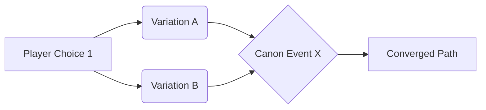
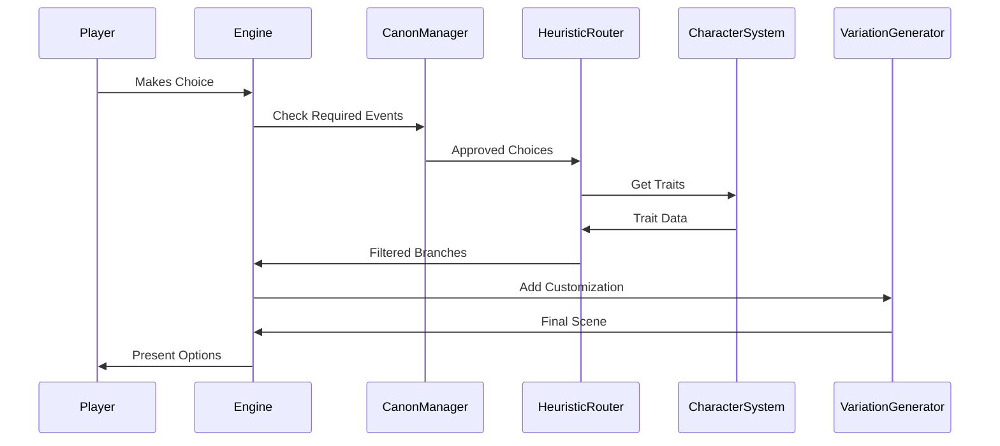

### **1. Story Structure Foundation**
#### **Core Components**
| Component          | Description                                                                 |
|---------------------|-----------------------------------------------------------------------------|
| **Iron Clad Plot**  | 5-7 mandatory events that *must* happen (e.g., "Betrayal in Act II")       |
| **Character Anchors** | 3 immutable traits per character (e.g., "Protagonist fears abandonment")  |
| **World Rules**     | Unbreakable story laws (e.g., "Magic requires sacrifice")                  |

#### **Example Prebaked Structure**
```python
story_arc = {
    "Act 1": {
        "canon_events": ["Meet Mentor", "Discover Artifact"],
        "variations": {
            "Mentor_Type": ["Strict", "Supportive"],  # Heuristic: Based on player's early choices
            "Artifact_Origin": ["Family Heirloom", "Stolen"]  # Tied to protagonist's "loyalty" trait
        }
    },
    "Act 2": {
        "canon_events": ["Betrayal", "Loss of Power"],
        "variations": {
            "Betrayer": ["Ally A", "Ally B"],  # Determined by relationship scores
            "Power_Loss_Type": ["Physical", "Social"]  # Based on player's skill investments
        }
    }
}
```

---

### **2. Heuristic Branching System**
#### **Decision Tree Rules**
```python
def get_story_branch(player_choice, character_state):
    if character_state["trust"] > 70 and player_choice == "confront":
        return "Betrayal_Angry"
    elif character_state["fear"] > 50 and player_choice == "avoid":
        return "Betrayal_Secretive"
    else:
        return "Betrayal_Default"  # Canon fallback
```

#### **Variation Constraints**
- **Personality-Locked Paths**: 
  ```python
  if protagonist.trait("impulsive") > 0.7:
      available_choices.remove("Diplomatic Approach")
  ```
- **Motive-Driven Options**:
  ```python
  if antagonist.motive("revenge") and player_helped_victim:
      unlock_path("Personal Vendetta Climax")
  ```

---

### **3. Canon Event Implementation**
#### **Mandatory Story Beats**
| Event Type         | Implementation Strategy                                  | Player Impact                             |
|--------------------|----------------------------------------------------------|-------------------------------------------|
| **Fixed Outcome**  | "The castle burns" happens regardless of choices         | *How* it burns varies (arson/accident)    |
| **Fixed Timing**   | Revelation of protagonist's secret in Act III            | *Who* discovers it changes                |
| **Fixed Consequence** | Major character death                                  | *Why* they die depends on prior actions   |

#### **Convergence Technique**


---

### **4. Character-Driven Branch Design**
#### **Trait-Based Path Matrix**
| Trait              | High Value Paths                  | Low Value Paths                 |
|---------------------|-----------------------------------|----------------------------------|
| **Courage** (>70)  | Charge into danger                | Secretly gather allies          |
| **Empathy** (>60)  | Forgive betrayal                  | Demand punishment                |
| **Curiosity** (>50)| Investigate mystery               | Accept surface explanation       |

#### **Secret Unlock System**
```python
class SecretHandler:
    def __init__(self):
        self.revealed_secrets = []
    
    def trigger_revelation(self, secret_id):
        if secret_id == "protagonist_orphan":
            return {
                "canon": "Learns true parentage",
                "variations": {
                    "Discoverer": ["Mentor", "Rival"]  # Based on trust levels
                }
            }
```

---

### **5. Production Pipeline**
1. **Narrative Spreadsheet**  
   Map all branches with IDs, conditions, and convergence points:
   ```csv
   BranchID,ParentID,CanonEvent,RequiredTraits,BlockedIf
   B1.2,B1,BetrayalEvent,Courage>60,SecretRevealed=3
   B1.3,B1,BetrayalEvent,Empathy<30,-
   ```

2. **State Machine Architecture**  
   ```python
   class StoryState:
       def __init__(self):
           self.variables = {
               "trust": {"ally1": 50, "ally2": 30},
               "secrets_known": 0
           }
           self.canon_flags = ["EVENT_1_COMPLETE"]
   ```

3. **Validation Tools**  
   - **Path Checker**: Ensures all branches lead to canon events  
   - **Contradiction Scanner**: Flags conflicting character actions  

---

### **6. Variation Design Principles**
1. **The 30% Rule**  
   - 70% of dialogue/scenes remain identical across branches  
   - 30% change based on traits/choices (e.g., different battle *reasons* but same outcome)  

2. **Mirror Sequences**  
   ```python
   def create_mirror_scene(base_scene):
       return {
           "angry_version": base_scene.replace("[emotion]", "snaps angrily"),
           "sad_version": base_scene.replace("[emotion]", "whispers tearfully")
       }
   ```

3. **Signature Moments**  
   - Unique scene per character trait combination:  
     ```python
     if protagonist.trait("reckless") and mentor.trait("strict"):
         play_scene("TrainingMontage_Harsh")
     ```

---

### **7. Player Agency Balance**
| Technique           | Implementation Example              | Purpose                          |
|----------------------|--------------------------------------|----------------------------------|
| **Illusory Choice** | "Attack left/right" → Same outcome  | Maintain pacing                  |
| **Weighted Choice** | Dialogue options grayed out by traits | Respect character consistency    |
| **Legacy Choice**   | Early decision changes late-game NPC dialogue | Create payoff illusion           |

---

### **8. Testing Framework**
1. **Path Coverage Check**  
   ```python
   def test_canon_coverage():
       assert all(event in played_events for event in CANON_EVENTS)
   ```

2. **Character Consistency Audit**  
   ```python
   def test_character_actions():
       for action in protagonist.actions:
           assert action in ALLOWED_ACTIONS[protagonist.traits]
   ```

3. **Variation Limits**  
   ```python
   MAX_VARIATIONS = {
       "major_event": 3,
       "dialogue_scene": 5
   }
   ```

---

This structured yet flexible approach allows:  
- **Authorial Control**: Critical story beats always occur  
- **Player Agency**: Meaningful variations within constrained parameters  
- **Production Efficiency**: Limited voice acting/scene variants needed  

By combining **heuristic decision trees** with **canon event convergence**, you create the illusion of infinite possibility while maintaining a manageable, coherent narrative structure.
---

### **1. Core System Architecture**
```python
class NarrativeEngine:
    def __init__(self):
        # Core Modules
        self.canon_manager = CanonEventManager()
        self.heuristic_router = HeuristicBranchSelector()
        self.variation_generator = VariationGenerator()
        self.state_tracker = GameStateTracker()
        
        # Data Stores
        self.predefined_branches = load_branch_map() 
        self.character_profiles = load_character_templates()
        self.world_rules = load_world_constraints()
```

---

### **2. Canon Event Enforcement**
#### **CanonEventManager Class**
```python
class CanonEventManager:
    def __init__(self):
        self.mandatory_events = {
            "ACT1": ["Inciting Incident", "First Betrayal"],
            "ACT2": ["Major Loss", "Truth Revelation"],
            "ACT3": ["Final Showdown"]
        }
        self.triggered_events = set()

    def get_next_canon(self, current_act):
        return [e for e in self.mandatory_events[current_act] 
                if e not in self.triggered_events]

    def enforce_canon(self, proposed_choices):
        """Prune choices conflicting with canon requirements"""
        next_required = self.get_next_canon(self.state_tracker.current_act)
        
        return [choice for choice in proposed_choices 
                if not self._blocks_canon(choice, next_required)]
```

---

### **3. Heuristic Branch Selection**
#### **HeuristicBranchSelector Class**
```python
class HeuristicBranchSelector:
    def select_branch(self, player_choice, character_state):
        # Priority 1: Canon-aligned paths
        if self._is_canon_critical(player_choice):
            return self._get_canon_path(player_choice)
        
        # Priority 2: Character-trait matching
        trait_based = self._match_traits(character_state)
        if trait_based:
            return trait_based
        
        # Priority 3: Plot momentum
        return self._default_progression(player_choice)

    def _match_traits(self, state):
        """Example: Fearful characters avoid confrontational paths"""
        if state['protagonist']['fear'] > 70:
            return self.predefined_branches["AvoidantPath"]
        elif state['protagonist']['curiosity'] > 60:
            return self.predefined_branches["InvestigatePath"]
```

---

### **4. Variation Generation System**
#### **VariationGenerator Class**
```python
class VariationGenerator:
    VARIATION_TEMPLATES = {
        "BattleScene": {
            "location": ["Tavern", "Forest", "Castle"],
            "enemy_motivation": ["Revenge", "Money", "Honor"],
            "weather": ["Rainy", "Sunny", "Foggy"]
        }
    }

    def generate_variation(self, base_event):
        template = self.VARIATION_TEMPLATES[base_event['type']]
        return {
            key: random.choice(options) if "motivation" not in key 
                 else self._motivation_by_character(key)
            for key, options in template.items()
        }

    def _motivation_by_character(self, key):
        """Tie variations to character relationships"""
        if self.state_tracker.relationships["antagonist"]["trust"] < 30:
            return "Personal Vendetta"
        return "Duty"
```

---

### **5. Narrative Flow Process**


---

### **6. Prebaked Branch Structure**
#### **Branch Definition Format (YAML)**
```yaml
branches:
  - id: betrayal_1
    canon_required: ["Act2_Start"]
    trigger_conditions:
      - "trust_score < 40"
      - "has_secret = true"
    variations:
      location: ["Tavern", "Castle"]
      betrayer: 
        - character: "AllyA"
          conditions: "alliance_days > 10"
        - character: "AllyB" 
    outcomes:
      canon: "ProtagonistLosesWeapon"
      variables:
        - "power_level -= 20"
```

---

### **7. Dynamic Dialogue System**
#### **Tag-Based Dialogue Variation**
```python
class DialogueGenerator:
    def generate(self, base_text, character):
        return base_text.replace("[TRAIT]", self._get_trait_tag(character))
    
    def _get_trait_tag(self, character):
        traits = character['traits']
        if traits['neuroticism'] > 70:
            return "(nervously) "
        elif traits['confidence'] > 60:
            return "(calmly) "
        return ""
```

**Example Output:**  
`"I... I don't know about this [TRAIT]"` →  
`"I... I don't know about this (nervously)"`

---

### **8. State Tracking & Validation**
#### **GameStateTracker Class**
```python
class GameStateTracker:
    def __init__(self):
        self.variables = {
            "relationships": defaultdict(int),
            "secrets_known": set(),
            "canon_progress": {}
        }
    
    def validate_state(self, proposed_branch):
        """Ensure branch preconditions are met"""
        return all(
            self._eval_condition(cond) 
            for cond in proposed_branch['trigger_conditions']
        )

    def _eval_condition(self, condition):
        """Example: Parse "trust_score < 40" """
        var, op, val = parse_condition(condition)
        return eval(f"self.variables['{var}'] {op} {val}")
```

---

### **9. Integration with Existing Engine**
#### **Modified generate_developments()**
```python
def generate_developments(self, context):
    # 1. Check canon requirements
    required_events = self.canon_manager.get_next_canon()
    
    # 2. Get prebaked branches matching current state
    valid_branches = [
        b for b in self.predefined_branches 
        if self.state_tracker.validate_state(b)
    ]
    
    # 3. Apply heuristic filtering
    filtered = self.heuristic_router.select_branches(
        valid_branches, 
        context['traits']
    )
    
    # 4. Generate variations
    return [
        self.variation_generator.generate(branch)
        for branch in filtered[:3]  # Limit to 3 choices
    ]
```

---

### **10. Balancing Techniques**
1. **Illusory Branching**  
   ```python
   def _create_parallel_choices(self, base_event):
       """Same outcome, different flavor text"""
       return [
           {"text": "Fight!", "path": "combat_1"},
           {"text": "Draw weapon", "path": "combat_1"},
           {"text": "Attack now", "path": "combat_1"}
       ]
   ```

2. **Convergence Points**  
   ```python
   CONVERGENCE_MAP = {
       "combat_1": ["aftermath_scene"],
       "dialogue_1": ["aftermath_scene"],
       "stealth_1": ["aftermath_scene"]
   }
   ```

3. **Weighted Choice Availability**  
   ```python
   def weight_choices(self, choices):
       """Make trait-aligned choices more prominent"""
       return sorted(
           choices, 
           key=lambda x: self._match_score(x['traits']), 
           reverse=True
       )[:2]
   ```

---

### **11. Testing & Validation Tools**
1. **Canon Compliance Checker**  
   ```python
   def test_canon_completion():
       assert engine.canon_manager.triggered_events == set(MANDATORY_EVENTS)
   ```

2. **Branch Coverage Validator**  
   ```python
   def test_branch_reachability():
       for branch in PREDEFINED_BRANCHES:
           assert can_trigger(branch), f"Unreachable branch: {branch['id']}"
   ```

3. **Consistency Auditor**  
   ```python
   def audit_character_actions():
       for action in logged_actions:
           assert action in character.ALLOWED_ACTIONS, 
                  f"{character.name} acted out of type"
   ```
