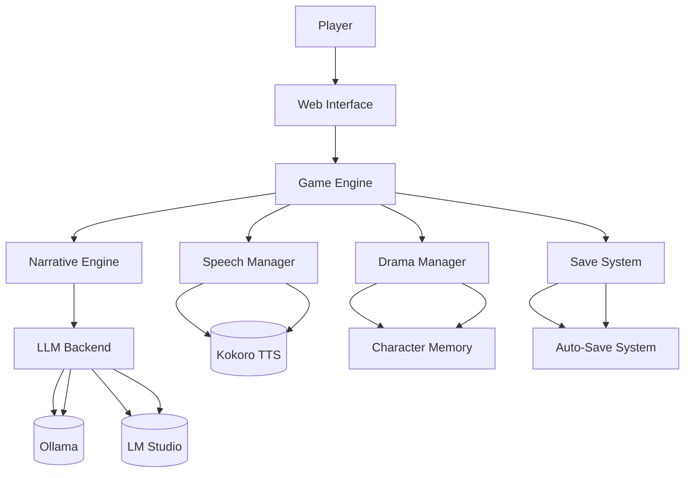

# AI Interactive Storytelling Engine


## Overview

This project implements an AI-driven interactive storytelling system where:
- Stories evolve based on player choices
- Characters respond dynamically using local LLMs
- Multiple possible story developments are generated at each step
- The narrative maintains consistency with themes and previous events

## Features ▶️
- **Dynamic Story Generation** using local LLMs (Ollama/LM Studio)
- **Character Memory System** with personality persistence
- **Multi-Model Support** with hot-switching
- **Voice Synthesis** integration
- **Auto-Save System** with metadata tracking

## Quick Start 🚀
```bash
uv venv
uv pip install -r requirements.txt
ollama pull mistral  # Core model
uv run streamlit run src/app.py
```

## Architecture Overview 🏛️


### Key Components
| Component | Purpose | Tech Stack |
|-----------|---------|------------|
| `app.py` | Web interface | Streamlit, Websockets |
| `game.py` | Core game loop | LangChain, LangGraph |
| `narrative_engine.py` | Story generation | Custom prompts |
| `model_providers.py` | LLM integration | Ollama, LM Studio, OpenAI |
| `drama_manager.py` | Dramatic analysis | Dramatic theory patterns |
| `speech_manager.py` | Voice synthesis | Kokoro TTS |
| `story_save_manager.py` | Save system | JSON schema validation |
- Parameter optimization

### Story Engine
- Dynamic narrative generation
- Character-driven responses
- Theme consistency
- Multiple choice paths
- State tracking

### Workflow
1. Run with voice synthesis enabled:
```bash
VOICE_ENABLED=true streamlit run src/app.py

2. Run drama manager tests:
```bash
python -m pytest tests/test_drama_manager.py -v
```

2. Run with debug mode:
```bash
DEBUG=true streamlit run src/app.py
```

3. Test components:
```python
python -m pytest tests/ -v
```

## Configuration Guide ⚙️

### Model Setup (`config/models.yml`)
```yaml
llama-lmstudio:
  provider: lmstudio
  model_name: llama-3.1-8b-lexi-uncensored-v2
  temperature: 0.8
  max_tokens: 2048
  context_window: 8192

mistral-ollama:
  provider: ollama
  model_name: mistral
  temperature: 0.7
  repeat_penalty: 1.1
  num_gpu: 1
```

### Game Templates (`config/game_config.yml`)
```yaml
# Add versioning
template_version: 1.2
schema: 
  - name: character_response
    required_vars: [character_info, situation]
```

## Contribution Guidelines 🤝
1. Create feature branch
2. Add tests for new features
3. Update documentation
4. Submit PR with:
   - Implementation details
   - Performance metrics
   - Example outputs

## Troubleshooting 🔧
| Issue | Solution |
|-------|----------|
| Model not responding | Check `ollama serve`/LM Studio status |
| Audio synthesis failures | Verify Kokoro model files exist |
| Save file corruption | Use `save_repair_tool.py` |
| Low response quality | Adjust temperature (0.7-1.0) |
| Drama analysis errors | Check character config templates |

## Contributing

Feel free to contribute by:
1. Opening issues for bugs or suggestions
2. Submitting pull requests with improvements
3. Adding new model integrations
4. Improving prompts and configurations

## License

This project is open source and available under the MIT License.
