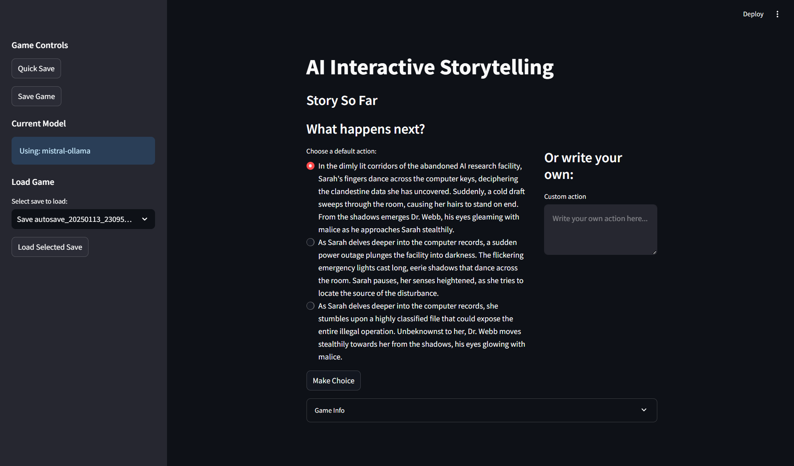

# AI Interactive Storytelling Engine

An interactive storytelling engine powered by AI that creates dynamic narratives with branching storylines and character interactions.



## Overview

This project implements an AI-driven interactive storytelling system where:
- Stories evolve based on player choices
- Characters respond dynamically to situations
- Multiple possible story developments are generated at each step
- The narrative maintains consistency with themes and previous events

## Key Features

### Web Interface
- Interactive Streamlit-based UI
- Story progression visualization
- Game state tracking and display
- Save/Load functionality
- Real-time character interactions

### Character System
- Dynamic character responses using AI
- Personality and background influence responses
- Conversation memory for contextual interactions
- Character-specific dialogue generation

### Narrative Engine
- Generates multiple possible story developments
- Creates branching narratives based on player choices
- Maintains story consistency and theme
- Provides meaningful choice consequences

### Story Management
- State tracking and progression
- Character interactions management
- Save/Load system with autosave
- Conversation history tracking

## Installation

1. Ensure you have Python 3.10+ installed
2. Clone this repository
3. Install uv (next-generation Python package installer):
```bash
pip install uv
```
4. Create and activate virtual environment using uv:
```bash
uv venv
source .venv/bin/activate  # On Unix/macOS
.venv\Scripts\activate     # On Windows
```
5. Install project dependencies using uv:
```bash
uv pip install -r requirements.txt
```
6. Install Ollama from https://ollama.ai
7. Pull required model:
```bash
ollama pull mistral
```

## Dependencies
Core dependencies:
- langchain==0.1.5
- langchain-community==0.0.13
- langchain-core==0.1.12
- langchain-ollama==0.0.5
- streamlit==1.32.0
- aiohttp==3.9.1
- pydantic==2.5.3

See requirements.txt for the complete list.

## Usage

### Web Interface
Run the Streamlit app:
```bash
streamlit run app.py
```

### Command Line Interface
Run the interactive story:
```bash
python game.py
```

## Features

### Story Engine
- Dynamic narrative generation
- Character-driven responses
- Theme consistency
- Multiple choice paths

### Save System
- Quick save/load functionality
- Autosave system
- Save file management
- State persistence

### Web Interface
- Interactive story display
- Choice visualization
- Game state tracking
- Save/Load management

## Technical Details

### Technologies Used
- LangChain v0.1.5+ for AI integration
- Ollama for local LLM execution
- Streamlit for web interface
- uv for dependency management
- Custom prompt templates
- State management system

### Architecture
- Component-based design
- State management system
- Event-driven story progression
- Memory-based context retention

## Current Story

The implementation features a sci-fi narrative about:
- Sarah Chen: A former tech CEO investigating AI phenomena
- Dr. Marcus Webb: An AI researcher working on consciousness transfer
- Setting: An abandoned AI research facility
- Theme: The ethical limits of scientific progress

## Project Structure
```
AIStoryTelling/
├── app.py           # Streamlit web interface
├── game.py          # Core game logic and CLI
├── story_save_manager.py  # Save/Load system
├── requirements.txt # Project dependencies
├── README.md        # Documentation
├── TODOS.md         # Development roadmap
└── saves/           # Save file directory
```

## Development Status

### Completed Features ✅
- Basic story engine
- Character response system
- Save/Load functionality
- Web interface
- State management
- Error handling

### In Progress 🚧
- Emotion tracking system
- Enhanced memory management
- Story analytics
- Character portraits
- Theme customization

See TODOS.md for detailed development roadmap.

## Contributing

Feel free to contribute by:
1. Opening issues for bugs or suggestions
2. Submitting pull requests with improvements
3. Adding new story scenarios or characters
4. Improving prompt templates

## License

This project is open source and available under the MIT License.