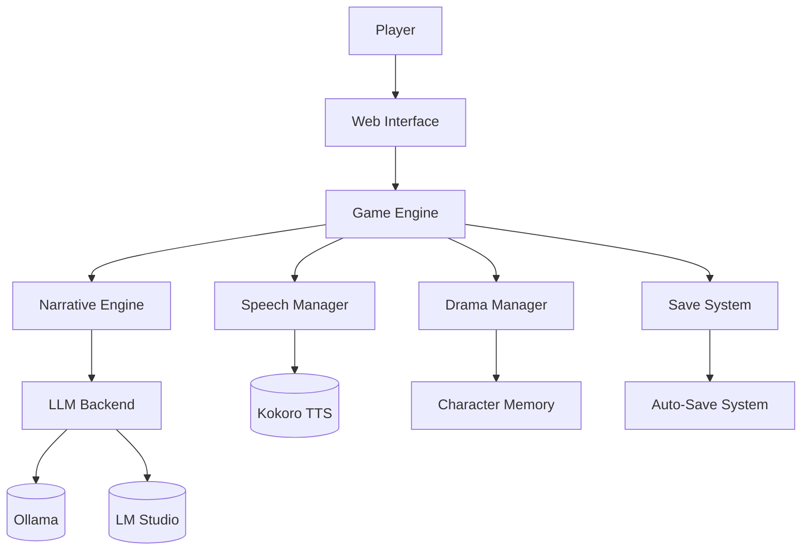

# AI Interactive Storytelling Engine


## Overview

This project implements an AI-driven interactive storytelling system where:
- Stories evolve based on player choices
- Characters respond dynamically using local LLMs
- Multiple possible story developments are generated at each step
- The narrative maintains consistency with themes and previous events

## Features ▶️
- **Dynamic Story Generation** using local LLMs (Ollama/LM Studio)
- **Character Memory System** with personality persistence
- **Multi-Model Support** with hot-switching
- **Voice Synthesis** integration
- **Auto-Save System** with metadata tracking

## Quick Start 🚀
```bash
uv venv
uv pip install -r requirements.txt
ollama pull mistral  # Core model
uv run streamlit run src/app.py
```

## Architecture Overview 🏛️


### Model Providers
- Ollama support for local models
- LM Studio integration for additional models
- Model switching and fallbacks
- Parameter optimization

### Story Engine
- Dynamic narrative generation
- Character-driven responses
- Theme consistency
- Multiple choice paths
- State tracking

### Workflow
1. Set up models:
```bash
# For testing multiple models
ollama pull llama2
ollama pull neural-chat
```

2. Run with debug mode:
```bash
DEBUG=true streamlit run src/app.py
```

3. Test components:
```python
python -m pytest tests/ -v
```

## Configuration Guide ⚙️

### Model Setup (`config/models.yml`)
```yaml
# Example production config
production_model:
  provider: ollama
  model_name: llama2
  temperature: 0.65
  max_tokens: 4096
  system_prompt: "You are a professional novelist..."
  
# Example testing config  
testing_model:
  provider: lmstudio
  model_name: codellama-7b
  temperature: 0.9
```

### Game Templates (`config/game_config.yml`)
```yaml
# Add versioning
template_version: 1.2
schema: 
  - name: character_response
    required_vars: [character_info, situation]
```

## Contribution Guidelines 🤝
1. Create feature branch
2. Add tests for new features
3. Update documentation
4. Submit PR with:
   - Implementation details
   - Performance metrics
   - Example outputs

## Troubleshooting 🔧
| Issue | Solution |
|-------|----------|
| Model not responding | Check `ollama serve` status |
| Low response quality | Adjust temperature (0.7-1.0) |

## Contributing

Feel free to contribute by:
1. Opening issues for bugs or suggestions
2. Submitting pull requests with improvements
3. Adding new model integrations
4. Improving prompts and configurations

## License

This project is open source and available under the MIT License.
