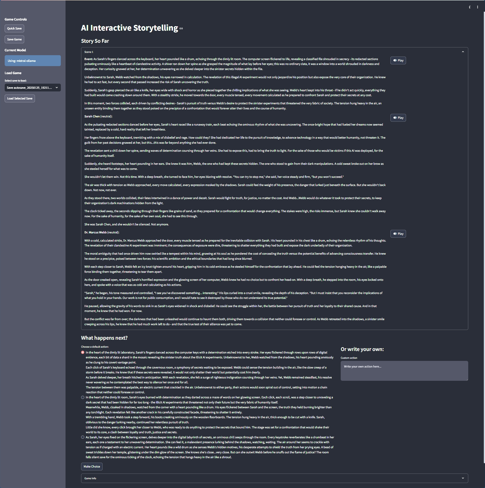

# AI Interactive Storytelling Engine

An interactive storytelling engine powered by AI that creates dynamic narratives with branching storylines and character interactions.



## Overview

This project implements an AI-driven interactive storytelling system where:
- Stories evolve based on player choices
- Characters respond dynamically using local LLMs
- Multiple possible story developments are generated at each step
- The narrative maintains consistency with themes and previous events

## Project Structure

```
AIStoryTelling/
├── src/               # Source code
│   ├── app.py        # Streamlit interface
│   ├── game.py       # Core game logic
│   ├── model_providers.py  # LLM integration
│   └── story_save_manager.py  # Save/Load system
├── config/           # Configuration files
│   ├── game_config.yml  # Game settings and templates
│   └── models.yml    # LLM configurations
├── saves/           # Save files directory
└── requirements.txt
```

## Features

### Local LLM Support
- Ollama integration (default)
- LM Studio compatibility
- Model hot-switching
- Configurable parameters

### Game Engine
- Config-driven templating
- Dynamic narrative generation
- Character persona management
- State persistence

### Save System
- Quick save/load
- Auto-saving
- Save metadata tracking
- State restoration

### Web Interface
- Model selection
- Story progression
- Choice visualization
- Save management

## Installation

1. Install Python 3.10+
2. Install dependencies:
```bash
pip install uv
uv venv
uv pip install -r requirements.txt
```

3. Install LLM backend(s):
```bash
# Ollama
ollama pull mistral  # Default model

# LM Studio
# Install from https://lmstudio.ai
```

## Usage

### Starting the Interface
```bash
streamlit run src/app.py
```

### Configuration
1. LLM Settings: `config/models.yml`
2. Game Settings: `config/game_config.yml`

### Command Line Version
```bash
python src/game.py
```

## Configuration

### LLM Setup (models.yml)
```yaml
models:
  mistral-ollama:     # Default model
    provider: ollama
    model_name: mistral
    temperature: 0.7
    # See models.yml for full options

  mixtral-lmstudio:   # Alternative model
    provider: lmstudio
    model_name: mixtral-8x7b-instruct
    # See models.yml for full options
```

### Game Setup (game_config.yml)
```yaml
templates:          # Prompt templates
  character_response:
    # Character dialogue generation
  story_progression:
    # Story development
  development:
    # Choice generation

game_settings:
  autosave_interval: 15
  max_choices: 3
  default_theme: "The ethical limits of scientific progress"

characters:
  sarah:
    name: "Sarah Chen"
    personality: "..."
  webb:
    name: "Dr. Marcus Webb"
    personality: "..."

# See game_config.yml for full options
```

## Contributing

1. Fork repository
2. Create feature branch
3. Submit pull request

See TODOS.md for current priorities.

## License

MIT License